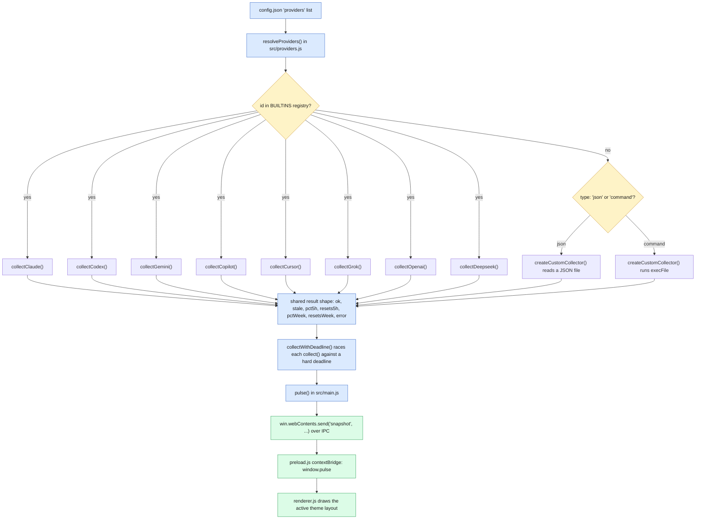

# Redline

A floating Windows desktop widget showing your **Claude Code** and **Codex CLI**
usage limits, the 5-hour and weekly windows, with live reset countdowns.

[](https://github.com/blaine-hiers/Redline/actions/workflows/ci.yml)


Frameless, transparent, always-on-top, draggable, lives in the system tray.
Six more meters (Gemini CLI, GitHub Copilot, Cursor, Grok, OpenAI, DeepSeek)
ship built in and switched off, and any other provider can be added from the
settings panel with no code change.

Electron, **zero runtime dependencies**, 24 test files under `node --test`.

## Quickstart

```bash
npm install
npm start              # run it
npm run dev:fake       # synthetic data, no credentials, no network
npm test               # node --test
npm run dist           # electron-builder --win
npm run screenshots    # regenerate docs/screenshots from fake data
```

`npm run dev:fake` runs the whole UI against synthetic data with no
credentials and no network. `npm run screenshots` reuses it to regenerate
every image in this README deterministically, so the docs cannot drift from
the themes.

## How a meter reaches the widget

Every meter — built in or custom — is resolved from `cfg.providers` in
`src/providers.js` into the same shape, then collected, then pushed to the
renderer over IPC. That common interface is what let a later change turn a
hardcoded Claude/Codex pair into an open-ended list without touching the
renderer, the tray, alerts, speech or history:



A resolved provider is:

```js
{ id, label, colour, enabled, minIntervalMs, windows, collect() }
```

`windows` is how a provider whose limits are not a 5-hour and a weekly window
says so. It renames both slots in every layout, and a null label in the
second slot means the service has no second window, so layouts omit the line
instead of printing an empty one. Claude and Codex carry no `windows`, which
keeps their rows byte-identical to what the screenshots pin.

### Built-in meters

| Meter | Reads from | Token needed | Window labels | On by default |
|---|---|---|---|---|
| Claude | Local credentials file, then `api.anthropic.com/api/oauth/usage` | No | 5h / week | Yes |
| Codex | Codex CLI's own local session files (`~/.codex/sessions/*.jsonl`) | No | 5h / week | Yes |
| Gemini CLI | Code Assist quota endpoint (`cloudcode-pa.googleapis.com`) | Optional (access token) | day | No |
| GitHub Copilot | GitHub's Copilot quota endpoint (`api.github.com/copilot_internal/user`) | Optional (OAuth token) | premium (plan-dependent) | No |
| Cursor | Cursor's usage endpoint (`cursor.com/api/usage`) | `WorkosCursorSessionToken` cookie | month | No |
| Grok | grok.com rate-limits endpoint | `sso` cookie | day (rolling, length from response) | No |
| OpenAI | Costs Admin API (`api.openai.com/v1/organization/costs`) | Admin key (`sk-admin-…`) | month | No |
| DeepSeek | Balance endpoint (`api.deepseek.com/user/balance`) | API key | balance (no reset countdown) | No |

Claude and Codex read files those tools already write locally, so they need
no token. The other six call a documented per-user quota endpoint and need a
credential pasted into the settings panel — none of these six has been
verified against a live account (each collector's header says so and cites
the source its endpoint and response shape came from).

### Custom meters

Any other provider is added from the settings panel's "Add custom meter"
form, or by hand-editing `config.json`, with no code change:

| Type | Config fields | Behaviour |
|---|---|---|
| `json` | `path` (absolute file path) | Reads `{ pct5h, resetsAt5h, pctWeek, resetsAtWeek }` from the file |
| `command` | `command`, `args[]`, `timeoutMs` (1s-60s, default 10s) | Runs the command with `execFile` (never a shell) and parses the same shape from stdout |

Percentages are 0-100; the two reset fields accept an ISO string, epoch
seconds, or epoch milliseconds. Every field is optional — a meter that only
knows its 5h window is fine. A custom meter's payload is defined as 5h +
week, so it carries no `windows` override.

## More themes

<details>
<summary>Terminal, HUD Rings, Neon Gauge, Paper, Carbon, Aurora, LCD</summary>

|  |  |
|---|---|
| <br>Terminal | <br>HUD Rings |
| <br>Neon Gauge | <br>Paper |
| <br>Carbon | <br>Aurora |
| <br>LCD | |

Eight themes ship. Adding one means adding a CSS block and an entry in
`themelist.js`.

</details>

## Install

Download `Redline Setup <version>.exe` (per-user, no admin prompt) or the
portable `Redline <version>.exe` from the release, or build them yourself
(see Quickstart above).

The build is unsigned, so SmartScreen warns the first time. Click **More
info** then **Run anyway**.

## Configuring

The settings panel handles meters (enable, reorder, paste a token), themes,
alert thresholds, autostart and window behaviour. Everything it writes lands
in `config.json` in the Electron userData folder, which can also be edited
directly.

| Key | Default | Meaning |
|---|---|---|
| `theme` | `"glass"` | One of the eight theme ids |
| `warnAt` | `80` | Percentage that crosses into a "warn" alert |
| `alertAt` | `95` | Percentage that crosses into an "alert" |
| `opacity` | `1.0` | Window opacity |
| `scale` | `1.0` | Card scale, derived from drag-resizing |
| `alwaysOnTop` | `true` | Keep the widget above other windows |
| `autoStart` | `false` | Launch at Windows sign-in |
| `speakAlerts` | `false` | Speak alerts and the usage summary aloud |
| `showHistory` | `true` | Show the sparkline history strip |
| `solidBackground` | `false` | Opaque background instead of the theme's transparency |
| `providers` | see Built-in meters | The ordered list of usage meters |
| `position` | `{ x: null, y: null }` | Saved window position |

The pulse interval is fixed at 6 minutes and is not user-configurable
(comfortably above Claude's own minimum poll interval). "Refresh now" in the
tray menu bypasses both that cadence and any active rate-limit cooldown.

## Data sources

### Looked at and not built

| Tool | Why |
|---|---|
| xAI developer API (`api.x.ai`) | Publishes rate-limit state only as response headers on a completions call, so reading it would mean spending your tokens purely to measure them |
| Windsurf / Codeium | No public per-user quota endpoint; the community extension watches a local database file instead |
| Amazon Q Developer | No known source. AWS documents service quotas, not per-user remaining quota |
| Mistral Le Chat | No known source for the consumer caps; La Plateforme exposes only the usual per-response rate-limit headers |
| Moonshot Kimi | A confirmed balance endpoint exists and is the same shape as DeepSeek's. Not built, but it would be a small addition |

### Where a pasted token is kept

A token you paste is written to **`config.json` in plain text** in the
Electron userData folder, like every other setting. It is not encrypted and
not stored in an OS keychain. It is sent only to that meter's own endpoint,
never written to a log, and stripped from everything the widget's own UI
receives: the settings panel is told only that *a* token is saved, never
what it is. Blank the field to clear it.

Credentials read from a tool's own files are read where they already live
and never copied into `config.json`.

## Rate limits are honoured, not retried through

A 429 from any provider is handled the same way: the server's `Retry-After`
drives the cooldown when it parses, and a fixed 2m, 4m, 8m, 15m ladder does
when it does not. A usage meter that hammers a rate-limited endpoint to find
out whether it is still rate limited is a meter that made the problem worse.

## Security

Nothing in `collectors/shared.js` logs, echoes or returns a credential.
`fail()` messages are written by the caller and must stay generic: a token
must never be interpolated into one, which is why neither `buildHeaders` nor
`classifyNetworkError` passes an exception's own message through.

`test/credleak.test.js` is the regression test for the finding below and
asserts all three layers independently, so removing any one of them fails
the suite.

<details>
<summary>The engineering worth reading</summary>

### A credential could reach the screen through an error message

The finding, and the reason `test/credleak.test.js` exists.

`undici` validates header values before sending, and when a value carries a
control character it throws `TypeError: Headers.append: "<the whole value>"
is an invalid header value`. The exception quotes **the entire credential
back**. That message went into `fail('network: ' + e.message)`, became
`services[].data.error`, crossed IPC, and rendered in every layout and in a
`title=` tooltip.

A pasted cookie is exactly the value that triggers it, because the sanitizer
only trimmed the ends.

The fix is three independent layers, each asserted separately:

1. **The sanitizer refuses the token.** A value containing a line break, tab
   or null is rejected and never written to `config.json`.
2. **No collector passes an exception's message on.** `buildHeaders` and
   `classifyNetworkError` construct their own generic text.
3. **A final scrub in `main.js`** strips any saved token out of an error
   string whatever produced it.

A bad paste is **rejected rather than silently repaired**. Quietly stripping
the newline would turn a visible paste error into a confusing authentication
failure later, which is the worse of the two outcomes.

### One registry, not a hardcoded pair

`providers.js` turns config into the ordered meter list that everything else
iterates. Before it existed, the pair "claude, codex" was hardcoded in
`pulse()`, alerts, speech, history, the sparkline payload, the tray tooltip
and all four layouts. Adding a third meter meant touching eight places and
missing one.

### Two collectors were deliberately not refactored

Claude's and Codex's collectors predate `shared.js` and keep their own
copies of its helpers. Rewriting them would change code that the committed
screenshots and test fixtures already pin, for no behavioural difference.
The duplication is cheaper than the churn, and the reason is recorded in the
source rather than left for someone to rediscover.

</details>
