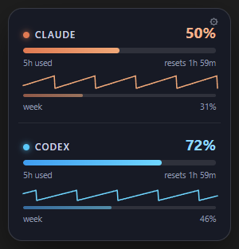
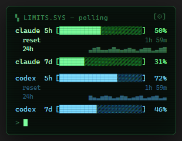
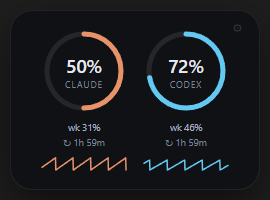
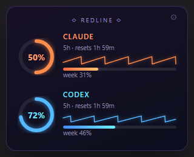
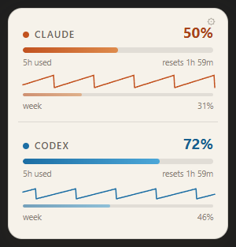
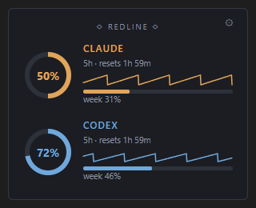
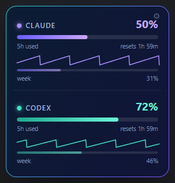
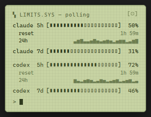

# Redline

A floating Windows desktop widget that shows your **Claude Code** and **Codex CLI**
usage limits — the 5-hour and weekly windows — with live reset countdowns and
eight switchable themes. Six more meters (Gemini CLI, GitHub Copilot, Cursor,
Grok, OpenAI, DeepSeek) ship switched off and can be turned on in the settings
panel; any other AI lab can be slotted in as an extra meter without a code
change (see **Meters**). Frameless, transparent, always-on-top, draggable;
lives in the system tray.

|  |  |
|---|---|
| <br>Frosted Glass | <br>Terminal |
| <br>HUD Rings | <br>Neon Gauge |
| <br>Paper | <br>Carbon |
| <br>Aurora | <br>LCD |

## Install

Download the installer (`Redline Setup <version>.exe`) or the portable exe
(`Redline <version>.exe`) from the GitHub release, or build them yourself
(see **Build** below) and grab them from `dist/`.

- **Installer**: per-user install, no admin prompt (UAC) required. Lets you pick
  the install directory; not a silent one-click install.
- **Portable**: a single self-contained exe — copy it anywhere and run it, no
  install step.

The build is unsigned, so Windows SmartScreen will warn ("Windows protected
your PC") the first time you run either one — click **More info → Run anyway**.

## Setup (from source)

```
npm install
npm start
```

`npm run dev:fake` runs it with animated fake data (for theme work, no real polling).

Right-click the widget (or the tray icon) for: theme picker,
always-on-top toggle, start with Windows, speak alerts toggle, history toggle,
solid background toggle, show widget, refresh now, open config file,
read usage aloud, quit. Closing the window hides it — the tray icon brings it
back; quit from the menu.

Click the small ⚙ cog in the widget's top-right corner (or the `[⚙]` in
**terminal**) for the same settings in an in-widget panel — every key in the
Config table below, including `warnAt`/`alertAt`/`opacity`, which used to be
hand-edit only. **Done** or **Escape** returns to the widget. Toggling
**Solid background** is the one exception: it can't be applied to a live
window, so the widget rebuilds it immediately — that closes the panel back
to the plain card rather than leaving it open, whichever surface you toggled
it from.

## Data sources

| Service | Source | Caveat |
|---|---|---|
| Claude | OAuth token from `~/.claude/.credentials.json` → `api.anthropic.com/api/oauth/usage` (the endpoint Claude Code's `/usage` uses) | Undocumented endpoint — shape may drift with Claude Code releases. Token is re-read from disk on every pulse; if it expires, the panel dims with "token stale — open Claude Code". |
| Codex | Last `rate_limits` entry in the newest `~/.codex/sessions/**/*.jsonl` | Purely local, no network. Only updates when Codex runs, but usage can't change while it's idle; when a window's reset time passes, the widget zeroes that bar locally. |
| six more | Gemini CLI, GitHub Copilot, Cursor, Grok, OpenAI, DeepSeek — **off by default**, see the table below | None has been verified against a live account. |
| anything else | A **custom meter** you configure: a JSON file, or a command whose stdout is that JSON | See **Meters** below. |

### The other six meters

These ship **disabled**. Turn one on in the settings panel's **Meters** list
(or set `"enabled": true` on its entry in `config.json`). Each looks for the
credential its own tool already stores, read-only; where that isn't possible,
or the lookup misses, paste one into the Token field the panel shows under
that meter.

An upgrade doesn't leave them hidden: a `config.json` written before a meter
existed gains an entry for it, switched off, the next time the widget starts —
so the panel always lists every built-in, whatever version wrote the file.
A built-in you delete from `config.json` by hand comes back the same way, still
switched off; to keep one out of the list, leave its entry there with
`"enabled": false`.

**Verified live: no — for every row.** They were built from each tool's own
source or the endpoint its established community client uses, and each is
tested against a fixture derived from that source. There was no account for
any of them on the machine they were written on, so nothing below has ever
been run against a real credential. Treat a first reading as the real test.

| Meter | Source (cited in the collector's header) | Credential it looks for | Window shown | Verified |
|---|---|---|---|---|
| **Gemini** | `POST cloudcode-pa.googleapis.com/v1internal:retrieveUserQuota` — `google-gemini/gemini-cli`, `packages/core/src/code_assist/{server,types}.ts`; the RPC behind the CLI's `/stats` | `~/.gemini/oauth_creds.json` (`access_token`). Recent versions keep it in the OS keychain instead, which this app does not touch — paste a token then. Needs `GOOGLE_CLOUD_PROJECT`, else it asks `:loadCodeAssist` for one | `day` — the tightest daily model bucket | no (request body shape-unconfirmed) |
| **Copilot** | `GET api.github.com/copilot_internal/user` — `microsoft/vscode`, `extensions/copilot/src/platform/chat/common/chatQuotaService.ts` | the **`github.com`** entry in `%LOCALAPPDATA%\github-copilot\apps.json`, then `hosts.json`, then `gh auth token --hostname github.com` (a machine signed in only to GitHub Enterprise counts as not signed in) | `premium` — monthly premium requests; falls back to `chat` / `completions` on a plan where those are the metered ones | no |
| **Cursor** | `GET cursor.com/api/usage?user=…` — `Dwtexe/cursor-stats`, `src/services/api.ts` | `%APPDATA%\Cursor\User\globalStorage\state.vscdb`, scanned for the `cursorAuth/accessToken` row (**best-effort**: a byte scan, not a SQLite engine — if it misses, paste the `WorkosCursorSessionToken` cookie) | `month` — premium requests | no |
| **Grok** | `POST grok.com/rest/rate-limits` — `rob-stout/Tokenomics`, `TQZHR/grok2api` | none readable — grok.com keeps its session in a browser cookie. **Paste the `sso` cookie** | the response's own rolling window (`day` for the usual 24h one) | no |
| **OpenAI** | `GET api.openai.com/v1/organization/costs` (Costs Admin API) | an organization **admin** key (`sk-admin-…`) pasted in the panel, or `OPENAI_ADMIN_KEY` | `month` — spend as a percentage of `budgetUsd` | no |
| **DeepSeek** | `GET api.deepseek.com/user/balance` | API key pasted in the panel, or `DEEPSEEK_API_KEY` | `balance` — how much of `budgetUsd` (your top-up) is gone; no reset, a balance has no window | no |

The two dollar-denominated meters need a ceiling to turn money into a
percentage, so **OpenAI and DeepSeek do nothing until `budgetUsd` is set** on
their entry in `config.json` (`{ "id": "openai", "enabled": true, "budgetUsd": 50 }`).
They say so on the card rather than inventing one.

Every one of these reports what is *left*; the widget's bars, thresholds and
spoken summary are all percent **used**, so each collector inverts once, at
the point it reads the number.

#### Looked at and not built

| Tool | Why |
|---|---|
| xAI developer API (`api.x.ai`) | Publishes rate-limit state only as response headers on a completions call, so reading it would mean spending your tokens purely to measure them. |
| Windsurf / Codeium | No public per-user quota endpoint; the community extension watches a local database file instead of calling anything. |
| Amazon Q Developer | No known source — AWS documents service quotas, not a per-user remaining-quota endpoint. |
| Mistral Le Chat | No known source for the *consumer* caps; La Plateforme only exposes the usual per-response rate-limit headers. |
| Moonshot Kimi | A confirmed balance endpoint (`api.moonshot.cn/v1/users/me/balance`) exists — not built, but it is the same shape as DeepSeek's and would be a small addition. |

#### Where a pasted token is kept

> A token you paste into the panel is written to **`config.json` in plain
> text**, in the Electron userData folder, exactly like every other setting.
> It is not encrypted and not stored in any OS keychain. It is sent only to
> that meter's own endpoint, is never written to a log, and is stripped out of
> everything the widget's own UI receives — the settings panel is told only
> that *a* token is saved, never what it is. Clear one by blanking its field.
> Credentials read from a tool's own files are read where they already live
> and never copied into `config.json`.

A token has to be a single line. One with a **line break** in it (the usual
result of copying a cookie out of the dev tools by hand) is **rejected, not
stored and not stripped** — paste it again without the break. Silently editing
a credential would only turn a visible paste error into a confusing
authentication failure, and the underlying HTTP library's own complaint about
such a value quotes the whole value back, which is the last thing that should
end up on a card.

## Meters

The widget draws one row per **meter**, in the order they are configured.
Claude and Codex are the two that are on out of the box; the six above are
built in but switched off. The settings panel's **Meters** section lets you
turn any of them on or off, reorder them with the ▲/▼ arrows, paste a token
for the ones that need one, and add meters of your own for labs that have no
first-party collector yet.

A meter whose service has only one window (all six of the new ones) draws one
bar labelled with that window's own name — `day`, `month`, `balance` — instead
of the `5h` / `week` pair Claude and Codex show.

**Add custom meter** asks for a name, an accent colour (`#rrggbb`) and one of
two sources:

- **JSON file** — an **absolute** path to a file you (or another tool) keep up
  to date (a relative one is rejected: it would resolve against wherever the
  app happened to be launched from). It is re-read only when its modification
  time changes.
- **Command** — an executable plus its arguments, one per line. Its **stdout**
  is parsed as the same JSON. It always runs under a timeout: `timeoutMs` is
  clamped into 1–60s; a missing or non-numeric value uses 10s. There is no way
  to disable the timeout.

Either way the expected payload is:

```json
{ "pct5h": 41, "resetsAt5h": "2026-09-03T14:00:00Z", "pctWeek": 63, "resetsAtWeek": 1788480000 }
```

All four fields are optional as long as one percentage is present; reset times
may be an ISO string, epoch seconds, or epoch milliseconds, and a reset already
in the past zeroes its bar. Percentages are clamped to 0–100.

A custom meter gets everything the built-ins get: the 6-minute pulse, the
last-good "stale" display when a read fails, the 2m → 4m → 8m → 15m retry
ladder, threshold toasts, spoken alerts, its own sparkline history and its own
accent colour in every theme.

In `config.json` the same thing looks like:

```json
"providers": [
  { "id": "claude", "enabled": true },
  { "id": "codex", "enabled": true },
  { "id": "cursor", "enabled": true },
  { "id": "openai", "enabled": true, "budgetUsd": 50 },
  { "id": "mylab", "enabled": true, "label": "My Lab", "colour": "#7dd3fc",
    "type": "json", "path": "C:/usage/mylab.json" },
  { "id": "otherlab", "enabled": true, "label": "Other Lab", "colour": "#9ae06a",
    "type": "command", "command": "node", "args": ["C:/usage/other.mjs"], "timeoutMs": 10000 }
]
```

> The ids `gemini`, `copilot`, `cursor`, `grok`, `openai` and `deepseek` are
> **taken by the built-in collectors**. A custom meter you had configured under
> one of those names before this version will now use the built-in collector
> instead of your file or command — rename it (any other id works) to get it
> back.

> **Security.** A command meter runs an executable **you** named in your own
> config. It is spawned with `execFile` — the program and its arguments are
> passed as an argv array, never as a shell string — so nothing in a path or an
> argument is interpreted as shell syntax. It runs with a timeout and a bounded
> output buffer, and nothing it prints is logged or displayed beyond the parsed
> numbers. Only your own config file (or the settings panel) can define one.
> A meter that hangs anyway is abandoned at a hard deadline, so it can never
> stall the other meters' readings.

## Config

`config.json` in the Electron userData folder (`%APPDATA%/redline`), editable
by hand or via the context menu. `history.json` lives beside it and holds the
usage samples behind the sparklines — one sample per 5 minutes at most, kept for
7 days (2500 max), written back a moment after each pulse. Each meter owns two
columns in it, `<id>.5h` and `<id>.wk` (a file written before meters existed is
migrated from the old `c5`/`cw`/`x5`/`xw` names once, on load). Deleting it just
clears the sparklines:

Every meter is polled every 6 minutes; **Refresh now** (menu or settings
panel) polls immediately, bypassing that cadence and any active 429 cooldown.

| Key | Default | Meaning |
|---|---|---|
| `theme` | `"glass"` | `glass` \| `terminal` \| `hud` \| `neon` \| `paper` \| `carbon` \| `aurora` \| `lcd`; also pickable in the menu and the settings panel |
| `warnAt` | `80` | Toast once when a window crosses this %; settings panel only (menu has no control for it), must stay below `alertAt` |
| `alertAt` | `95` | Second, stronger toast threshold; settings panel only, enforced above `warnAt` |
| `opacity` | `1.0` | Window opacity, 0.2–1.0; settings panel slider applies it live |
| `scale` | `1.0` | Widget size, 0.6–3.0. Drag any window edge to resize — the width sets the scale, and the height always snaps back to whatever fits the card — or use the settings panel's Size slider / Reset size. A window whose content grew past the edge of the display is moved back on screen, and content still taller than the work area (the settings panel at a large scale) is shrunk to fit, so no control ends up unreachable |
| `alwaysOnTop` | `true` | Also toggleable in the menu and the settings panel |
| `autoStart` | `false` | Start with Windows (tray only, `--hidden`); also toggleable in the menu and the settings panel (Windows only) |
| `speakAlerts` | `false` | Speak each threshold alert aloud (in addition to the toast). Also toggleable in the menu and the settings panel |
| `providers` | Claude + Codex on, six more off | The ordered list of meters — see **Meters** above. Edit it in the settings panel rather than by hand. A built-in entry may also carry `token` (plain text — see above) and, for the spend-based meters, `budgetUsd` |
| `showHistory` | `true` | Draw the 24h usage sparkline under each 5h row; also toggleable in the menu and the settings panel |
| `solidBackground` | `false` | Opaque window instead of transparent — see Troubleshooting below; also toggleable in the menu and the settings panel |
| `position` | last drag | Window position, persisted automatically |

The window height is never configured: the renderer measures the card it just
drew and asks for exactly that content size, so turning on history or showing a
stale/retry note grows the window rather than getting cut off at the bottom.

## Themes

Each theme gives Claude and Codex a palette of its own; every other meter —
the six that ship off included — is drawn in its own accent colour, the one the
registry gives it or the one you picked when adding it (except **lcd**, which
is deliberately monochrome and inks every other meter in its own dark olive).

- **glass** — frosted dark glass, ember (Claude) / ice (Codex) accents
- **terminal** — CRT phosphor green with scanlines and a blinking cursor
- **hud** — two minimal progress rings, smallest footprint
- **neon** — synthwave glowing arcs and gradient bars
- **paper** — the glass layout in warm off-white: ink text, hairline dividers,
  darkened ember/ice accents. The light theme.
- **carbon** — the neon layout gone flat and matte: no glow, 1px borders,
  square corners, amber (Claude) / steel (Codex)
- **aurora** — the glass layout in deep navy, with an aurora gradient drifting
  round the border over 12s (still under `prefers-reduced-motion`, and frozen
  during a screenshot run so captures stay deterministic)
- **lcd** — the terminal layout as a retro handheld: pale green LCD, dark olive
  segments, `▮▯` bars, a faint segment grid, no scanlines

A theme is a **layout** plus a **skin**: the layout is the render function that
builds the card (`glass`, `terminal`, `hud`, `neon`) and the skin is a
`body[data-theme="<id>"]` block in `renderer/themes.css`, so paper and aurora
reuse the glass layout, carbon the neon one and lcd the terminal one.
`renderer/themelist.js` is the one catalogue behind the tray menu, the settings
panel's picker, the config allowlist, the card sizing and the screenshot loop —
add a theme there and in `themes.css`, and every surface picks it up.

Regenerate the screenshots above after a theme change with:

```
npm run screenshots
```

This runs `electron . --fake --screenshot docs/screenshots` — deterministic fake
data, one PNG per theme written to `docs/screenshots/`. It always captures the
two default meters, so the committed PNGs only move when a layout does; add
`--providers 3` to a `--fake` run to see how a layout handles a third row, or
`--providers all` (or `--providers cursor,grok`) to preview the built-in meters
that ship switched off, with deterministic data and no network. Screenshot mode starts
from Redline's built-in defaults, ignoring any saved config, and never
writes to `%APPDATA%/redline`.

Each theme draws a sparkline of the last 24 hours of the 5h window under its 5h
row (block characters in **terminal**, an SVG polyline elsewhere); a failed pulse
leaves a gap in the line. The widget grows to fit it, and shrinks back when
`showHistory` is off or fewer than two samples exist.

## Build

```
npm run dist        # NSIS installer + portable exe -> dist/
npm run dist:dir     # unpacked dir only, for a quick smoke test -> dist/win-unpacked/
```

Both run [electron-builder](https://www.electron.build/). The app icon
(`build/icon.png`) is generated from `scripts/make-icon.mjs` (no external image
tools) — regenerate it with `node scripts/make-icon.mjs` if you change the
colors. Output is unsigned; see the SmartScreen note above.

## Troubleshooting

**Black box around the widget on one monitor.** Hybrid-GPU laptops (an
integrated GPU plus a discrete one, each driving different outputs) can't
composite a transparent, per-pixel-alpha window on the monitor attached to
the non-primary GPU adapter — the card renders inside a hard-edged black
rectangle instead of a transparent one. Turn on **Solid background** from
the right-click menu or the settings panel's checkbox (an opaque card, no
transparency, works on every monitor), or set this app's GPU preference in
Windows Settings → System → Display → Graphics to match the monitor it
lives on.

## Tests

```
npm test
```

Collectors are pure functions tested against fixtures. Claude's and Codex's
fixtures were captured from real data (sanitized); the six added later have no
live account behind them, so theirs are built from the response shapes their
cited sources declare. Every collector's test injects its own `fetch` and `fs`,
so the suite needs no network, no Electron and no credential — and the "makes
no network call without a credential" rule is asserted, not assumed.

## Security

The OAuth token is read from Claude Code's own credentials file at pulse time,
sent only to `api.anthropic.com`, and never logged or stored anywhere else.
The Codex collector never touches the network. Custom **command** meters run
only what your own config names, via `execFile` with an argv array (no shell),
under a timeout and a bounded output buffer — see the note under **Meters**.

The same rules hold for the six meters added later, each of which is off until
you turn it on:

- **Credentials are read where the tool already keeps them**, read-only, at
  pulse time. Nothing is written to those files and nothing is copied out of
  them into this app's own config.
- **No meter touches the network before it has found a credential.** With
  nothing to authenticate with, it renders its own "here's what would fix
  this" message and makes no request at all.
- **A token is sent only to its own service's endpoint**, never logged, and
  never interpolated into an error message. A failed request is reported as a
  fixed classification (`network: timeout` / `dns` / `refused` / `network
  error`) rather than the underlying exception's own text, which can quote the
  URL, a header, or the credential inside it. Request headers are built and
  validated *before* the call for the same reason. As a last line of defence,
  any saved token is scrubbed out of a meter's error message before it reaches
  the widget at all.
- **Copilot's credential is scoped to github.com.** Its config files routinely
  also hold a GitHub Enterprise token, and the quota endpoint is
  `api.github.com` — so only a `github.com` entry is used, and the `gh`
  fallback runs `gh auth token --hostname github.com`. A machine signed in only
  to an enterprise instance reports "not signed in" rather than sending that
  token somewhere it was never issued for.
- **The renderer never receives a token.** Everything the widget's UI is sent
  has saved tokens stripped out and replaced with a "one is saved" flag, so a
  credential can't end up in a devtools dump or a screenshot.
- The one credential this app runs a program to get is Copilot's fallback:
  `gh auth token --hostname github.com`, spawned with `execFile` and an argv
  array (no shell) under a 4-second timeout.
- Tokens you paste in the panel are stored in plain text in `config.json` — see
  **Where a pasted token is kept** above.
